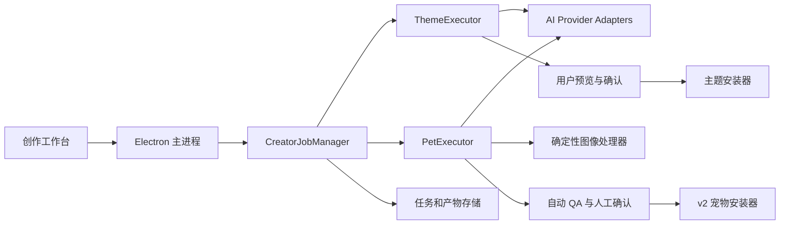

# Codress 主题与宠物生成方案

## 1. 背景与目标

Codress 的创作工作台目前已经具备 AI 服务配置、本机 Provider 检测、模型列表、草稿保存和流程展示，但尚未实现真正的图片生成、后台任务、质量检查与产物安装。

本方案的目标是建立一套统一的创作基础设施，并在其上实现两条独立流水线：

- 主题流水线：生成背景、预览确认、生成元数据并本地安装。
- 宠物流水线：兼容 `hatch-pet` v2 的生成、确定性处理、QA、打包和安装合同。

宠物规范以本机安装的 `${CODEX_HOME}/skills/hatch-pet/SKILL.md` 为当前设计基准。该技能主要规范宠物，不覆盖主题生成，因此主题需要由 Codress 单独维护工作流合同。

## 2. 当前状态

当前“保存并准备生成”只会：

1. 检查名称和创作描述。
2. 检查是否保存了 API Key。
3. 将草稿状态更新为 `ready`。
4. 提示用户等待生成执行器。

目前没有文本或图片生成请求，也没有以下能力：

- 后台生成任务和进度事件
- 生成、暂停、取消与恢复
- 参考图和生成产物管理
- 主题预览与重绘
- 宠物逐行动作生成
- 宠物方向、连续性与图集 QA
- 创作产物打包和原子安装

现有 `CreatorWorkspace`、安全密钥存储、Provider 检测、`/models` 拉取和草稿存储可以保留，作为新任务引擎的基础。

## 3. 生成方式决策

### 3.1 推荐：Codress 直接调用模型 API

面向普通用户时，建议由 Codress 调用用户配置的模型 API：

```text
用户点击生成
→ Renderer 通过 IPC 创建任务
→ Electron 主进程读取加密保存的密钥
→ Worker 调用文本、图片或视觉模型 API
→ 响应归一化并保存到本地任务目录
→ 本地确定性脚本处理和校验
→ 用户确认
→ 打包并安装
```

API 负责生成视觉内容，本地脚本负责尺寸、拆帧、透明背景、组装、校验和打包。Renderer 永远不能读取 API Key，也不直接调用外部模型或执行本地脚本。

该模式应描述为“兼容 `hatch-pet` v2 合同”，而不是“直接执行 `hatch-pet` 技能”，因为技能要求通过 Codex 的 `$imagegen` 层进行生成。

### 3.2 可选：由 Codex Agent 执行技能

如果要求字面上执行 `hatch-pet`，可以提供一个可选运行器：

```text
Codress 创建任务包
→ 启动可用的 Codex Agent 环境
→ Agent 加载 hatch-pet
→ hatch-pet 通过 $imagegen 生成
→ Agent 执行确定性脚本和 QA
→ Codress 读取进度与最终产物
```

这种方式依赖用户本机存在可调用的 Codex Agent、技能和图片生成能力，不应作为普通用户的唯一生成方式。

### 3.3 技能脚本的交付方式

生产版本不能依赖开发机器上的绝对路径。开发阶段可以检测 `${CODEX_HOME}/skills/hatch-pet`，正式交付需要选择以下方式之一：

1. 验证本机技能版本并调用其脚本。
2. 在许可允许的前提下固定版本并随应用打包。
3. 依据公开的输入输出合同重写确定性处理器。

无论采用哪种方式，都要保存处理器版本，确保历史任务可以解释和复现。

## 4. 总体架构



### 4.1 Renderer

- 编辑草稿和参考图。
- 创建、暂停、恢复和取消任务。
- 展示真实进度、错误与成本信息。
- 展示图片、contact sheet、GIF 和 QA 报告。
- 在明确的人工检查节点接受、拒绝或要求重绘。

### 4.2 Electron 主进程

- 管理密钥、配置和文件访问权限。
- 管理 IPC 和任务生命周期。
- 验证 Renderer 传入的任务、文件和操作。
- 启动隔离 Worker 并转发进度事件。
- 在安装前执行最终校验。

### 4.3 Worker

- 调用 Provider Adapter。
- 执行长时间生成和确定性脚本。
- 将中间结果持续保存到任务目录。
- 支持按步骤重试，不重复执行已经通过的步骤。

Worker 不直接修改 Codex 或 WorkBuddy 安装目录。只有主进程安装器在最终验证通过后执行安装。

## 5. 模型与 Provider 能力

创作需要区分三类能力：

- 文本能力：整理需求、生成提示词和元数据。
- 图片生成能力：生成主题背景、宠物主形象和动作条。
- 视觉理解能力：检查身份一致性、动作语义、方向、裁切和异常元素。

一个 Provider 可以同时提供多种能力，也允许用户分别配置：

```text
文本模型：Claude 或 OpenAI 兼容文本模型
图片模型：支持图片生成的服务
视觉模型：支持图片输入的多模态模型
```

`/models` 只表示服务返回了模型标识，不能证明某个模型支持图片生成或视觉输入。模型配置需要增加能力状态：

```ts
interface ModelCapability {
  text: boolean | "unknown";
  imageGeneration: boolean | "unknown";
  vision: boolean | "unknown";
}
```

连接测试应拆分成：

- 测试文本请求
- 测试图片生成能力
- 测试视觉输入能力

图片生成测试可能产生费用，必须在界面中明确提示，并避免在保存配置时自动执行。

Provider Adapter 负责将不同服务的请求和响应归一化：

```ts
interface TextProvider {
  generateStructured<T>(request: TextRequest): Promise<T>;
}

interface ImageProvider {
  generate(request: ImageRequest): Promise<GeneratedImage>;
}

interface VisionProvider {
  inspect<T>(request: VisionRequest): Promise<T>;
}
```

图片响应无论来自 URL 还是编码数据，都要由 Worker 下载或解码后保存为任务目录中的真实文件，再进入后续步骤。

## 6. 任务模型

`CreatorDraft` 继续表示用户可以编辑的方案。新增独立的 `CreatorJob` 表示一次不可变输入快照上的执行任务：

```ts
interface CreatorJob {
  id: string;
  draftId: string;
  kind: "theme" | "pet";
  status:
    | "queued"
    | "running"
    | "waiting-user"
    | "paused"
    | "failed"
    | "complete"
    | "cancelled";
  phase: string;
  progress: number;
  runDir: string;
  providerSnapshot: {
    textProvider?: string;
    textModel?: string;
    imageProvider: string;
    imageModel: string;
    visionProvider?: string;
    visionModel?: string;
  };
  currentArtifact?: string;
  error?: {
    code: string;
    message: string;
    retryable: boolean;
  };
  createdAt: string;
  updatedAt: string;
}
```

每个生成步骤独立保存：

```ts
interface CreatorJobStep {
  id: string;
  status: "pending" | "running" | "review" | "passed" | "failed";
  attempts: number;
  inputHash: string;
  artifacts: string[];
  qaFiles: string[];
  error?: string;
}
```

`inputHash` 用于避免草稿、参考图或模型变化后错误复用旧产物。

## 7. 文件与恢复策略

任务文件存放在 Electron `userData`：

```text
creator/
  ai.json
  drafts.json
  jobs.json
  runs/
    <job-id>/
      job.json
      input/
      artifacts/
      logs/
      theme/
      pet/
```

宠物任务内部保持 `hatch-pet` 的目录和产物名称：

```text
pet/
  pet_request.json
  imagegen-jobs.json
  prompts/
  references/
  decoded/
  frames/
  final/
  qa/
```

要求：

- JSON 使用临时文件和原子重命名写入。
- 每个步骤开始和结束都持久化。
- 记录 Provider、模型、处理器版本、重试次数和输入哈希。
- 应用重启后从最近一个通过的步骤恢复。
- 已通过的产物不得因为后续失败被覆盖。
- 原始生成结果和最终安装产物必须分目录保存。

## 8. 主题生成流水线

### 8.1 输入

- 作品名称
- 创作描述
- 风格与限制
- 目标应用
- 可选参考图
- 可选负面要求

### 8.2 状态机

```text
prepare
→ generating-preview
→ waiting-preview-review
→ processing
→ waiting-final-review
→ packaging
→ ready-to-install
→ complete
```

### 8.3 步骤

1. 文本模型将需求整理为 `theme-spec.json`，明确场景、构图、色调、焦点、安全区域和禁止元素。
2. 图片模型生成纯背景，不得绘制应用 UI、文字、按钮或未经允许的 Logo。
3. 本地处理器按目标应用裁切、缩放并生成最终图。
4. 生成带界面安全区域的 QA 预览。
5. 视觉模型检查文字、UI、异常元素和主体遮挡风险。
6. 用户选择接受、重绘、上传替换或调整裁切。
7. 生成主题元数据和安装包。
8. 先临时预览，再由用户确认正式安装。

一次普通主题任务通常包含 0 至 1 次文本调用、1 次图片调用和 0 至 1 次视觉检查；每次重绘增加一次图片调用。

主题第一版只支持本地安装，不自动投稿商店。

## 9. 宠物生成流水线

### 9.1 准备

输入除名称、描述和风格外，还应支持：

- 角色参考图
- 物种或角色类型
- 必须保持的身份特征
- 禁止出现的元素
- 风格预设和补充说明
- 品牌名称和品牌参考

如果用户只输入品牌名而没有具体角色或参考图，需要先生成品牌研究摘要，再提取安全的吉祥物提示，不能复制 Logo、标语或界面。

准备阶段生成 `pet_request.json`、`imagegen-jobs.json`、布局参考图和各动作提示词。

### 9.2 主形象

先生成唯一 canonical base。用户需要能够：

- 接受主形象
- 输入修改意见重新生成
- 上传图片替换
- 查看名称、描述、风格和身份锁定信息

主形象通过后，才能开始动作生成。之后的每个动作都必须附带 canonical base 和对应布局参考图。

### 9.3 九个标准动作

```text
base
 ├─ idle
 ├─ running-right
 ├─ waving
 ├─ jumping
 ├─ failed
 ├─ waiting
 ├─ running
 └─ review

running-right
 └─ running-left
```

`running-left` 只有在镜像不会改变文字、标记、服装、道具、光照或角色身份时，才允许通过确定性脚本从 `running-right` 派生；否则必须单独生成。

每一行动作生成后立即执行：

- 提取动作帧
- 检查帧数与非空
- 检查裁切和跨格
- 检查组件断裂
- 检查基本动作语义
- 生成行级 QA 和 GIF

单行失败只重试该行，不重新生成全部动作。

### 9.4 标准动作审核

生成并展示：

- 8×9 中间 contact sheet
- 9 个动作预览 GIF
- 每行通过、警告或失败状态
- 单行重新生成入口

中间 8×9 图集只用于审核，不能作为新宠物安装包。

### 9.5 四方向锚点

生成并审核固定顺序的四个方向：

- `000`：向上
- `090`：屏幕右侧
- `180`：向下
- `270`：屏幕左侧

任何基准方向模糊或错误都必须先修复，不能让最终两行自行推断左右方向。

### 9.6 十六方向

方向 row 9：

```text
000, 022.5, 045, 067.5, 090, 112.5, 135, 157.5
```

方向 row 10：

```text
180, 202.5, 225, 247.5, 270, 292.5, 315, 337.5
```

依赖顺序必须是：

```text
四方向锚点
→ 生成 row 9
→ row 9 注册、边缘和语义 QA
→ 生成 row 10
→ row 10 注册、边缘和语义 QA
```

单个方向失败时，重新生成其所在的完整八帧行，不直接替换最终单元格。

### 9.7 最终处理与 QA

确定性处理至少包括：

- 组装 `1536×2288` 的 8×11 图集
- 使用任务记录的 chroma key 清理背景
- 对完整 v2 图集执行一次 despill
- 校验 `192×208` 单元格和透明区域
- 生成扩展 contact sheet
- 生成 neutral 加 16 方向 QA 图
- 测量相邻方向连续性
- 生成动作预览 GIF

必须保留的 QA 文件包括：

```text
qa/review.json
qa/contact-sheet-extended.png
qa/look-directions.png
qa/direction-semantics.json
qa/look-continuity.json
qa/chroma-despill-extended.json
final/validation-extended.json
qa/run-summary.json
```

严格模式还需要制作匿名 A/B 方向图，分别提交给三个相互隔离的视觉请求，并按多数票生成 `direction-blind-validation.json`。四个基准方向是硬门槛，中间方向的不确定结果可在有明确证据时作为警告处理。

### 9.8 调用规模

一次正常宠物任务大约需要 12 至 13 个图片生成作业：

- 1 个主形象
- 9 个标准动作行，其中 `running-left` 可能确定性派生
- 1 个四方向锚点
- 2 个八帧方向行

失败重试会增加调用次数。界面在开始前应提示预计调用规模，任务运行时记录真实调用次数和可用的费用信息。

## 10. 宠物安装门槛

创作产物只有满足以下条件，安装按钮才可用：

- 最终图集为 PNG 或 WebP，尺寸恰好为 `1536×2288`
- 单元格为 `192×208`
- `pet.json` 包含 `spriteVersionNumber: 2`
- `validate_atlas --require-v2` 通过
- despill 报告为通过
- `qa/review.json` 没有错误
- 四方向锚点明确通过
- 16 个方向没有失败语义
- 最终独立视觉检查或明确用户检查通过

安装流程采用：

```text
生成目录
→ 临时安装目录
→ 再次校验
→ 原子移动到 ~/.codex/pets/<pet-id>
→ 用户确认后激活
```

现有商店宠物安装器必须读取图集真实尺寸：`1536×1872` 按 v1 安装，`1536×2288` 按 v2 安装，其他尺寸拒绝安装；不能仅通过写入 `spriteVersionNumber: 2` 声明资源符合 v2。Creator 新生成的宠物仍只允许输出 v2。

## 11. IPC 设计

建议新增：

```text
creator:jobs:list
creator:job:get
creator:job:start
creator:job:pause
creator:job:resume
creator:job:cancel
creator:job:retry-step
creator:job:approve-step
creator:job:reject-step
creator:job:install
creator:artifact:open
creator:artifact:read
creator:reference:pick
```

主进程向 Renderer 发送：

```text
creator:job:changed
creator:job:progress
creator:job:artifact
creator:job:needs-review
```

IPC 输入必须由主进程验证。Renderer 不能传入任意脚本路径、任意安装目录或未经确认的外部 URL。

## 12. 后台执行策略

第一版建议支持：

- 切换页面后继续运行
- 最小化窗口后继续运行
- 退出应用时安全停止
- 下次启动从最近通过的步骤恢复

对应用户文案应为：

> 可切换页面或最小化窗口；退出应用后将在下次启动时继续。

如果要求退出应用后仍持续运行，需要增加独立守护进程或托盘常驻服务，并单独处理更新、资源限制、崩溃恢复和用户退出语义，不纳入第一版。

## 13. 并发、重试与成本控制

- 宠物图片生成最多并发 3 个独立作业。
- 尊重依赖关系；row 10 不得早于 row 9 QA 通过。
- 网络超时、限流和服务端错误使用指数退避。
- 语义或视觉失败不做无限自动重试，交给明确的行级修复。
- 同一根因连续失败两次后更换策略，不继续微调相同提示词。
- 用户取消后停止新请求，允许正在写文件的步骤安全收尾。
- 保存调用次数、耗时、Provider 请求标识和可获得的使用量信息。
- 开始长任务前展示预计调用规模，并允许设置最大重试次数或费用上限。

## 14. 安全要求

- API Key 只保存在 Electron `safeStorage` 加密数据中。
- Renderer 只读取是否已配置和掩码，不读取明文。
- 外部服务默认必须使用 HTTPS，仅允许 localhost 使用 HTTP。
- 参考图、提示词和生成图片默认仅保存在本机任务目录。
- 如果将图片发送给第三方视觉服务，必须在界面中说明。
- 安装路径由主进程解析并限制在明确的主题或宠物目录。
- 下载和生成文件先进入临时目录，通过类型和尺寸检查后再使用。
- 日志不得记录 API Key、完整认证头或包含密钥的 URL。

## 15. 实施阶段

### 阶段一：任务引擎

- 新增 `CreatorJobManager`
- 新增 Worker 子进程
- 持久化任务、步骤和产物
- 进度事件、暂停、取消、恢复和重试
- 参考图选择和任务目录管理
- Provider 能力拆分和测试

### 阶段二：主题完整闭环

- 主题需求整理
- 图片生成与本地处理
- 预览、重绘和上传替换
- 目标应用临时预览
- 元数据和本地安装

主题先完成端到端，用来验证任务引擎、Provider、产物、审核和安装链路。

### 阶段三：宠物标准动作

- 接入或重写 `prepare_pet_run` 合同
- 主形象确认
- 九个动作行生成
- 增量拆帧和行级 QA
- contact sheet 和 GIF
- 单行动作重试

### 阶段四：v2 方向与 QA

- 四方向锚点
- row 9 和 row 10
- 注册、边缘和语义检查
- 连续性检查
- 三次隔离方向盲测
- despill 和 v2 validation

### 阶段五：安装和体验完善

- 原子宠物安装
- 任务恢复和历史记录
- 调用次数、耗时和成本展示
- 中间文件清理策略
- 商店投稿流程

## 16. 第一版验收标准

第一版可以分两次验收。

主题 MVP：

- 用户配置可用的图片模型
- 创建主题任务并看到真实进度
- 至少生成一张预览
- 支持重绘和上传替换
- 用户确认后可以本地安装
- 应用重启后任务和产物仍然存在

宠物 MVP：

- 完整跑通 canonical base、9 个标准动作、四方向、row 9 和 row 10
- 所有确定性和视觉 QA 产物可查看
- 失败动作可以单独重试
- 只有通过 v2 校验的 `1536×2288` 图集可以安装
- 最终产物包含 `pet.json` 和 `spritesheet.webp`
- 任务中断后可以从最近通过的步骤恢复
